# Manual do Usuário – Cupcake Haven

App de Cupcakes Gourmet – Situação 2. As imagens deste manual são **capturas de tela
reais** do sistema em funcionamento (tela de celular de 390 px e, na administração,
tela de computador de 1280 px). Os nomes, e-mails e pedidos que aparecem nelas são
dados de teste.

> **Ambiente de demonstração:** o pagamento é simulado. Nenhum valor real é cobrado.

## Sumário

1. [Acessar o sistema](#1-acessar-o-sistema)
2. [Criar conta](#2-criar-conta)
3. [Entrar e sair](#3-entrar-e-sair)
4. [Ver o cardápio](#4-ver-o-cardápio)
5. [Pesquisar e filtrar](#5-pesquisar-e-filtrar)
6. [Ver os detalhes de um cupcake](#6-ver-os-detalhes-de-um-cupcake)
7. [Carrinho](#7-carrinho)
8. [Cupom de desconto](#8-cupom-de-desconto)
9. [Endereço de entrega](#9-endereço-de-entrega)
10. [Pagamento (simulado)](#10-pagamento-simulado)
11. [Confirmação do pedido](#11-confirmação-do-pedido)
12. [Acompanhar o pedido](#12-acompanhar-o-pedido)
13. [Meus pedidos (histórico)](#13-meus-pedidos-histórico)
14. [Avaliar um pedido](#14-avaliar-um-pedido)
15. [Notificações](#15-notificações)
16. [Minha conta e endereços](#16-minha-conta-e-endereços)
17. [Ajuda e suporte](#17-ajuda-e-suporte)
18. [Área do administrador](#18-área-do-administrador)
19. [Mensagens mais comuns](#19-mensagens-mais-comuns)

---

## 1. Acessar o sistema

1. Peça para quem instalou o sistema iniciar o servidor (veja o `README.md`).
2. Abra o navegador (Chrome, Edge ou Firefox) em **http://127.0.0.1:8000**.
3. A primeira tela é o **Cardápio**. Não é preciso entrar na conta para ver os
   cupcakes e montar o carrinho.

No celular, a barra de baixo tem **Início**, **Carrinho**, **Pedidos** e **Conta**.
No computador, essa barra aparece no topo. No cabeçalho ficam o **sino**
(notificações) e o **carrinho**, com a quantidade em um círculo vermelho.

## 2. Criar conta

1. Toque em **Conta** e depois em **Criar conta** (ou vá direto em "Finalizar compra",
   que pede login).
2. Preencha **Nome completo**, **E-mail**, **Telefone** (opcional), **Senha** e
   **Confirmar senha**.
   - A senha precisa ter **pelo menos 8 caracteres, com letras e números**.
3. Toque em **Criar conta**. A conta é criada, você já fica logado e aparece
   "Conta criada! Bem-vindo(a)."

Se algo estiver errado, a mensagem aparece em vermelho logo abaixo do campo:

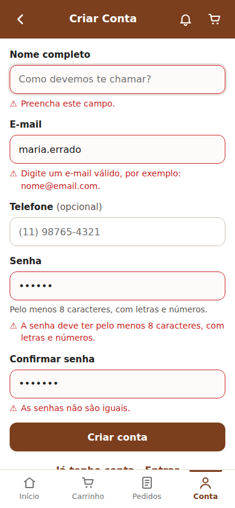

Não há endereço no cadastro: ele é pedido na hora de finalizar o pedido.

## 3. Entrar e sair

**Entrar:** toque em **Conta**, informe e-mail e senha e toque em **Entrar**. O botão
**Mostrar** exibe a senha digitada. Depois do login você volta para a tela em que
estava (por exemplo, o carrinho).

Se o e-mail ou a senha estiverem errados, aparece "E-mail ou senha incorretos."
(o sistema não diz qual dos dois está errado, por segurança):

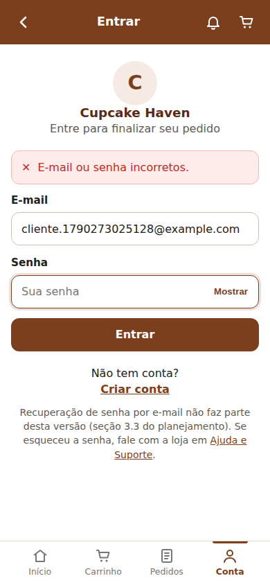

**Esqueci minha senha:** a recuperação de senha por e-mail não faz parte desta versão
(ficou fora do escopo no planejamento). Fale com a loja em **Ajuda e Suporte**.

**Sair:** em **Conta**, toque em **Sair**. Aparece "Você saiu da sua conta." e você
volta ao cardápio.

## 4. Ver o cardápio

Os cupcakes aparecem agrupados por categoria (Clássicos, Especiais, Frutados), com
foto, nome, preço e selos. Toque em **Adicionar** para colocar 1 unidade no carrinho.

Cupcakes sem estoque aparecem com o selo **⊘ Indisponível** e sem o botão Adicionar.

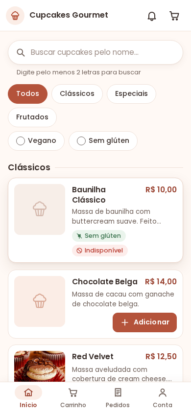

## 5. Pesquisar e filtrar

- **Pesquisar:** digite pelo menos **2 letras** no campo "Buscar cupcakes pelo nome...".
  A busca não diferencia maiúsculas nem acentos ("limao" encontra "Limão").
- **Categoria:** toque em **Todos** ou em uma categoria.
- **Restrições:** toque em **Vegano** e/ou **Sem glúten**. Dá para combinar com a
  categoria e com a busca.
- **Limpar filtros:** volta à lista completa.

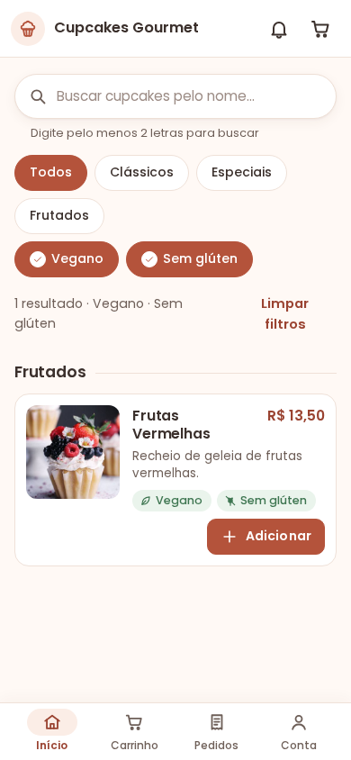

Se nada for encontrado, aparece "Nenhum cupcake encontrado. Tente outro nome ou limpe os filtros.":

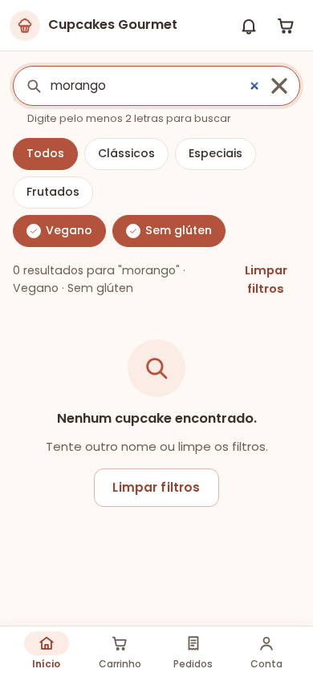

## 6. Ver os detalhes de um cupcake

Toque no nome ou na foto do cupcake. A tela mostra descrição, ingredientes e os
**alérgenos em destaque**. Escolha a quantidade com **−** e **+** (o máximo é o
estoque) e toque em **Adicionar ao carrinho**.

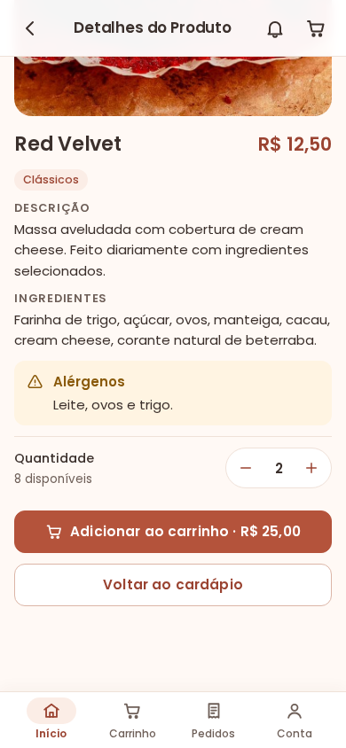

## 7. Carrinho

Toque no ícone do carrinho ou em **Carrinho** na barra.

- **+ / −** alteram a quantidade (mínimo 1, máximo o estoque).
- A **lixeira** remove o item ("Item removido do carrinho.").
- O resumo mostra **Subtotal**, **Desconto**, **Taxa de entrega** e **Total**.
- **Continuar comprando** volta ao cardápio; **Finalizar compra** segue para o endereço.

Se um item mudou de preço ou ficou sem estoque depois de ser adicionado, aparece um
aviso e o item fica destacado; ajuste ou remova o item para continuar.

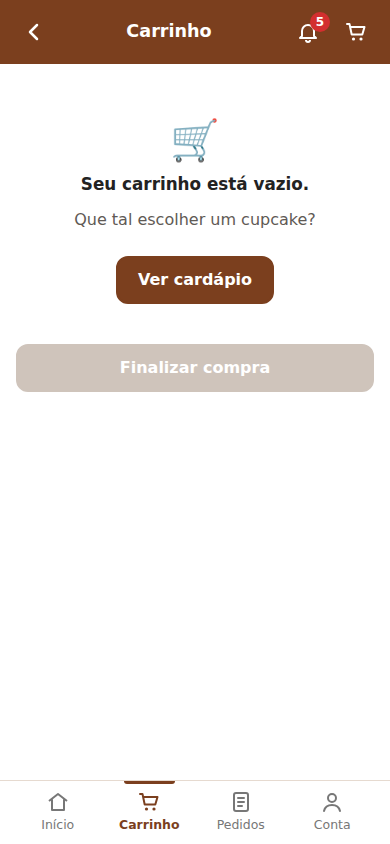

## 8. Cupom de desconto

1. Entre na sua conta (cupom exige login).
2. No carrinho, digite o código no campo **Cupom de desconto** e toque em **Aplicar**.
3. Com o cupom válido aparece "Cupom aplicado! Você economizou R$ ..." e a linha de desconto.

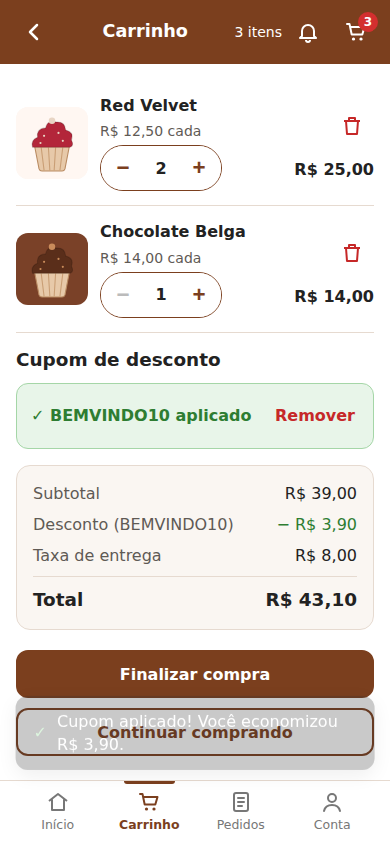

Se o cupom não puder ser usado, aparece o motivo (não encontrado, vencido, inativo ou
já utilizado):

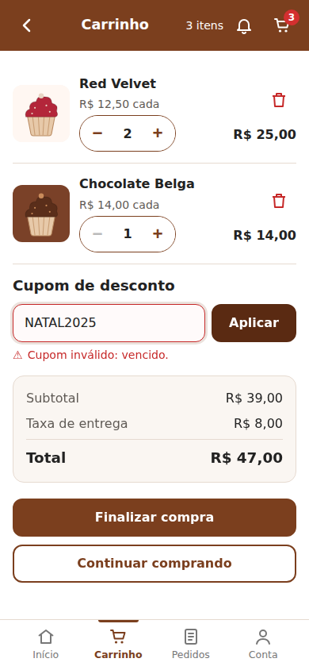

Regras: um cupom por pedido (aplicar outro troca o anterior); cada conta usa o mesmo
cupom uma vez; o desconto não vale para a taxa de entrega. Toque em **Remover** para
tirar o cupom.

## 9. Endereço de entrega

Ao tocar em **Finalizar compra** (etapa 1 de 2):

- O **endereço padrão** já vem marcado. Toque em outro para trocar.
- **+ Cadastrar novo endereço** abre o formulário e depois volta para cá.
- Se você ainda não tem endereço, o formulário abre direto.

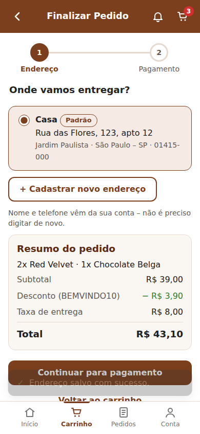

No formulário, o **CEP** deve ter 8 números e os campos obrigatórios não podem ficar vazios:

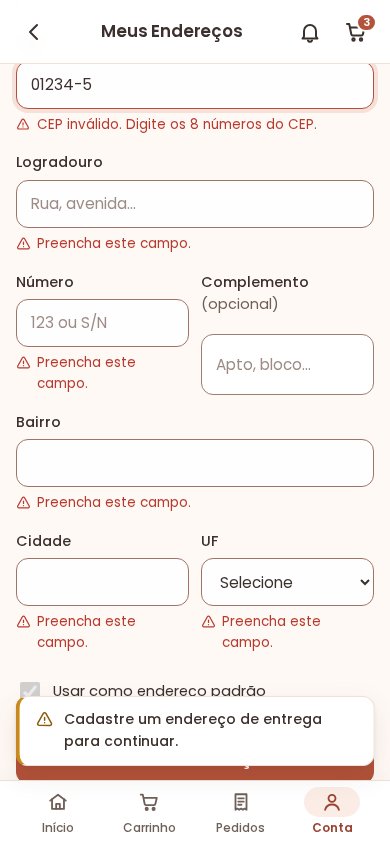

Toque em **Continuar para pagamento**.

## 10. Pagamento (simulado)

1. Confira o **Total a pagar** e o aviso "Ambiente de demonstração".
2. Escolha **Crédito**, **Débito** ou **PIX**.
3. **Cartão:** preencha número (16 dígitos), nome impresso, validade (MM/AA) e CVV
   (3 dígitos) e toque em **Confirmar pagamento**. Os dados do cartão não são salvos.
4. **PIX:** aparece um QR Code **ilustrativo**; toque em **Simular pagamento PIX**.

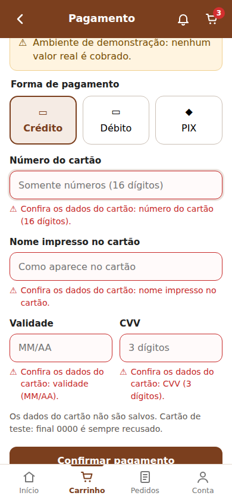
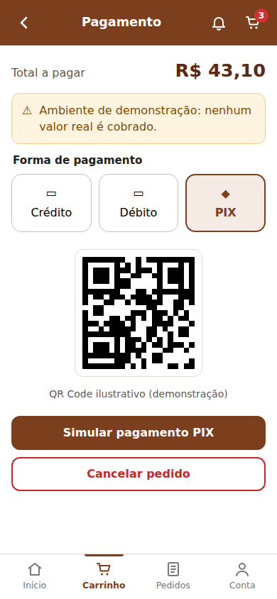

**Pagamento recusado:** na demonstração, cartão com final **0000** é sempre recusado.
Aparecem três opções: **Tentar novamente**, **Trocar forma de pagamento** ou
**Cancelar pedido** (se cancelar, os itens continuam no carrinho).

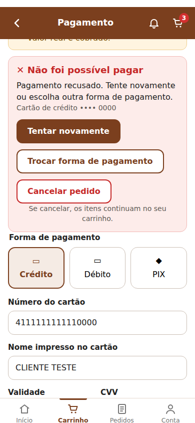

## 11. Confirmação do pedido

Com o pagamento aprovado, aparece o **número do pedido** (formato
CUP-AAAAMMDD-NNNN) e o resumo. O carrinho é esvaziado e você recebe uma notificação.

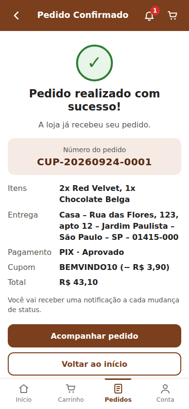

## 12. Acompanhar o pedido

Toque em **Acompanhar pedido** (ou em **Ver detalhes ›** em Meus Pedidos, ou em uma
notificação). A linha do tempo mostra as etapas **Pedido recebido → Em preparo → Saiu
para entrega → Entregue**, com a etapa atual destacada e o horário de cada uma.

- A tela **se atualiza sozinha a cada 30 segundos**; o botão **↻ Atualizar** consulta na hora.
- Se não for possível atualizar, aparece "Não foi possível atualizar agora. Mostrando o último status."
- **Precisa de ajuda?** abre a tela de suporte.

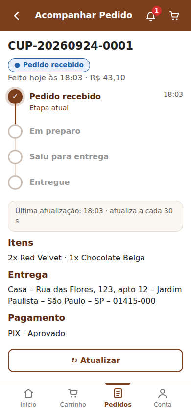

Pedido cancelado aparece com cor, ícone e texto:

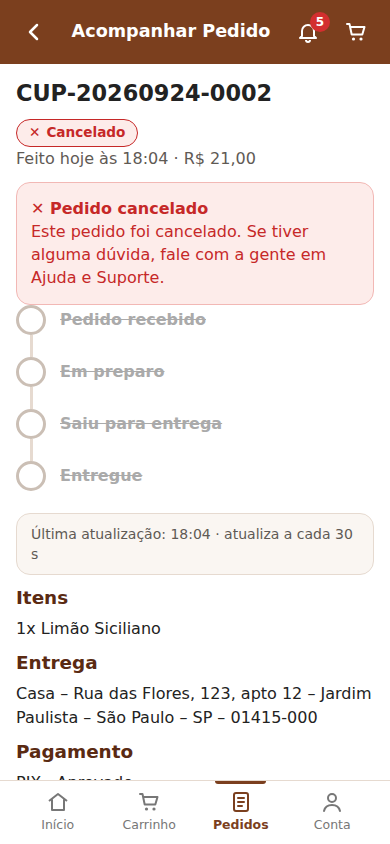

Se o pedido ainda estiver **aguardando pagamento**, a tela mostra **Pagar agora** e
**Cancelar pedido**.

## 13. Meus pedidos (histórico)

Toque em **Pedidos** na barra. Os pedidos aparecem do mais recente para o mais antigo,
10 por página, com número, data, total e status.

- **Ver detalhes ›** abre o acompanhamento.
- **Repetir pedido** (pedidos entregues) coloca no carrinho os itens que ainda estão
  disponíveis, com o preço atual. Os que não estiverem disponíveis são avisados.
- **Avaliar** aparece nos pedidos entregues que ainda não foram avaliados.

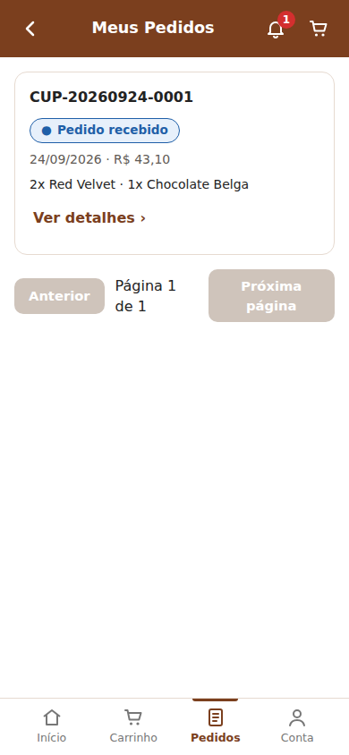

## 14. Avaliar um pedido

1. Em **Meus Pedidos**, toque em **Avaliar** no pedido entregue.
2. Toque nas **estrelas** (1 a 5 – obrigatório).
3. Se quiser, escreva um comentário (até 500 caracteres; o contador mostra quantos faltam).
4. Toque em **Enviar avaliação**. Aparece "Obrigado pela avaliação!".

A avaliação não pode ser editada depois de enviada; a nota aparece no pedido.

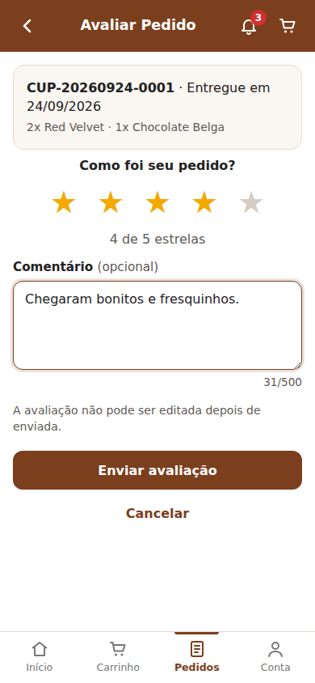
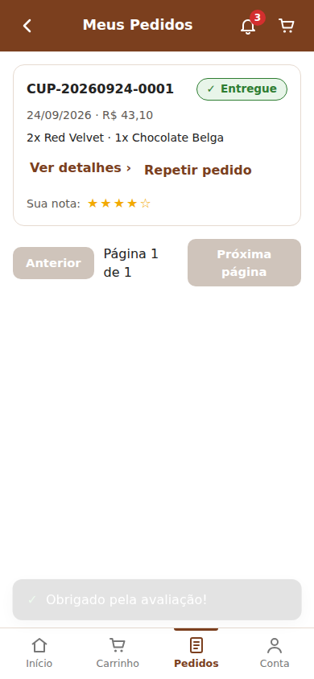

## 15. Notificações

Cada mudança de status do pedido gera uma notificação. O **sino** mostra quantas não
foram lidas. Na tela de notificações, as não lidas ficam destacadas; tocar em uma
marca como lida e abre o acompanhamento do pedido. **Marcar todas como lidas** limpa o contador.

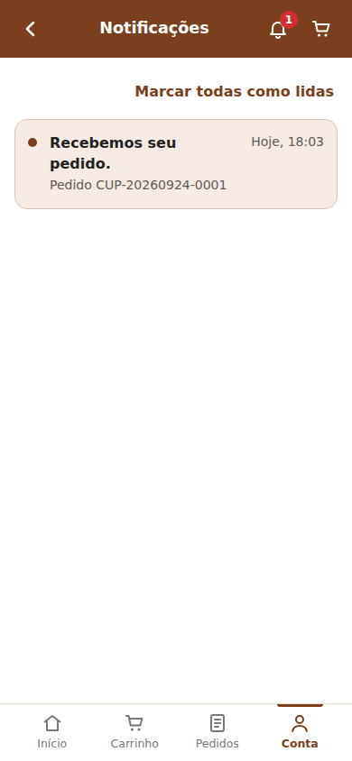

## 16. Minha conta e endereços

Em **Conta**:

- Altere **Nome** e **Telefone** e toque em **Salvar dados** (o e-mail não pode ser alterado nesta versão).
- Atalhos: **Meus Pedidos**, **Meus Endereços** (mostra "x de 5"), **Notificações** e **Ajuda e Suporte**.
- **Sair** encerra a sessão.

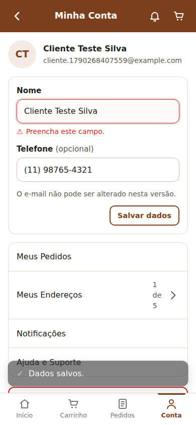

**Meus Endereços** (até 5):

- **+ Adicionar endereço**, **Editar**, **Excluir** (pede confirmação) e **Tornar padrão**.
- O primeiro endereço vira o padrão. Se você excluir o padrão, o mais antigo passa a ser o padrão.
- Excluir ou editar um endereço **não altera** pedidos já feitos.

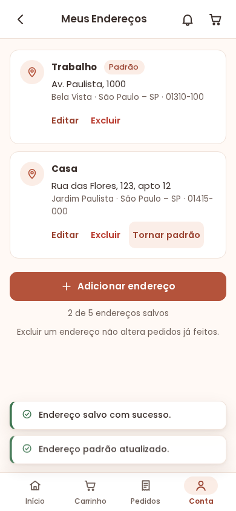

## 17. Ajuda e suporte

Mostra o **horário de atendimento** (segunda a sábado, das 9h às 19h), as
**perguntas frequentes** (toque para abrir/fechar) e o botão **Falar no WhatsApp**,
que abre a conversa com a loja. Fora do horário aparece o aviso de que a resposta virá
no próximo horário.

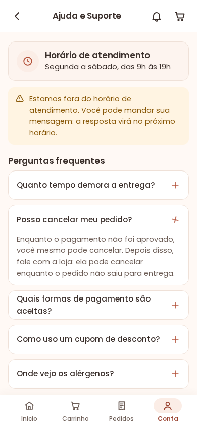

> O número do WhatsApp configurado no projeto é **fictício** (demonstração).

## 18. Área do administrador

Entre com uma conta de perfil **ADMIN** (conta de teste: veja o `README.md`). Depois
do login você vai direto para o **Painel de Pedidos**. O menu do topo tem **Pedidos**,
**Produtos** e **Sair**. Clientes que tentarem abrir essas telas recebem "Você não tem
permissão para acessar esta página."

### 18.1 Painel de pedidos

Lista número, cliente, data, total e status, do mais recente para o mais antigo.
Use os botões de **status** para filtrar e **Abrir** para ver o pedido.

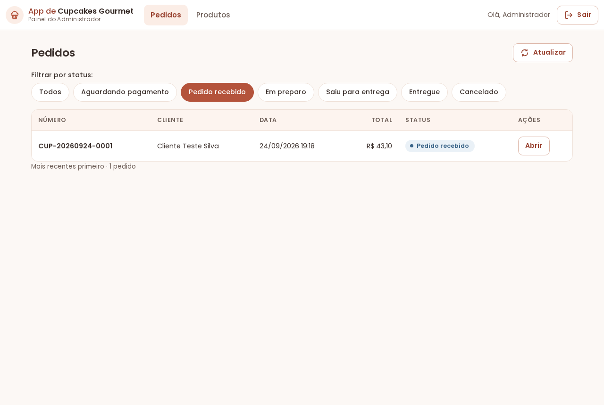

### 18.2 Atualizar o status

No detalhe do pedido aparecem cliente, endereço, itens, pagamento, cupom e avaliação.
Na caixa **Atualizar status** aparece **só o botão do próximo status permitido**:

| Status atual | Botão |
|--------------|-------|
| Pedido recebido | Iniciar preparo |
| Em preparo | Marcar como "Saiu para entrega" |
| Saiu para entrega | Marcar como "Entregue" |

Cada mudança gera uma notificação para o cliente e mostra "Status do pedido atualizado para ...".

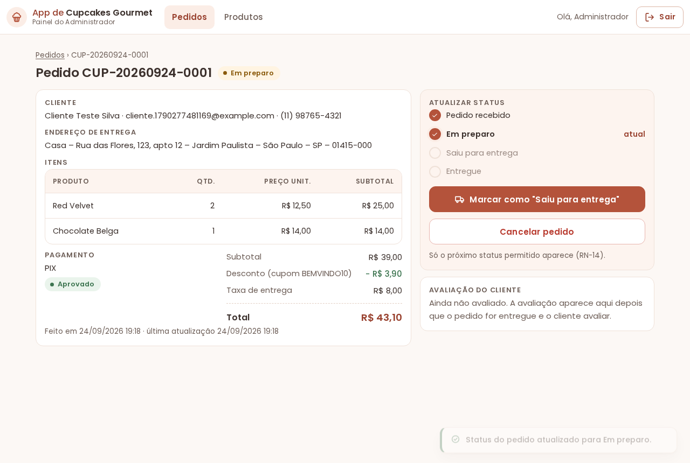

**Cancelar pedido** aparece enquanto o pedido está "Pedido recebido" ou "Em preparo".
É pedida uma confirmação; as quantidades voltam para o estoque.

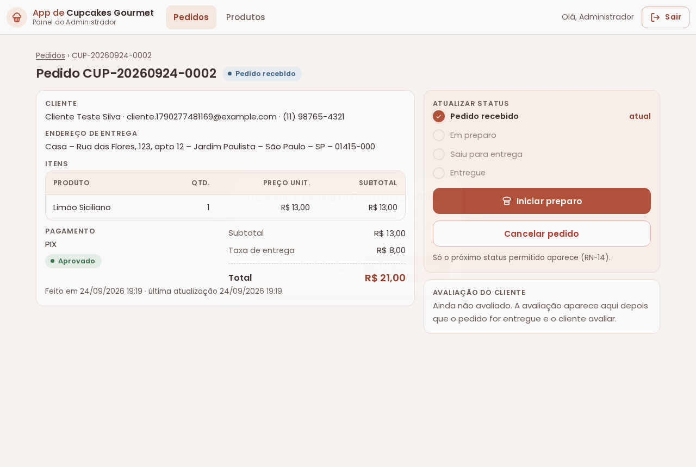

Se o pedido foi alterado em outra aba, aparece "Não foi possível mudar o status. O
pedido pode ter sido atualizado. Recarregue a página." e a tela é recarregada.
Pedidos "Aguardando pagamento" não têm ação do administrador.

### 18.3 Produtos

Lista todos os produtos (ativos e inativos) com categoria, preço, estoque e situação.

- **+ Novo produto** e **Editar** abrem o formulário.
- **Desativar** (pede confirmação) esconde o produto do cardápio sem apagá-lo;
  **Reativar** mostra de novo. Produtos não são excluídos.

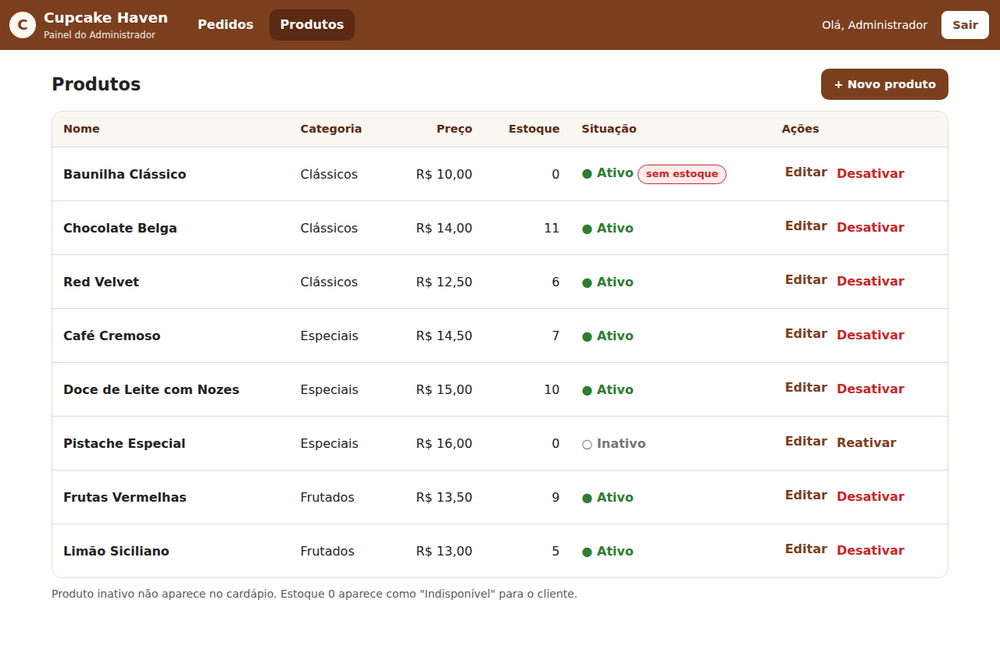

No formulário, preencha nome, categoria, descrição, ingredientes, alérgenos, preço,
estoque, caminho da imagem e as opções Vegano / Sem glúten / Ativo. A **prévia** mostra
a imagem. Para usar uma imagem nova, coloque o arquivo em
`frontend/assets/images/produtos/` e informe o caminho (ex.:
`assets/images/produtos/coco.svg`). Se o campo alérgenos ficar vazio, o sistema grava
"Não contém alérgenos declarados". Mudar o preço não altera pedidos já feitos.

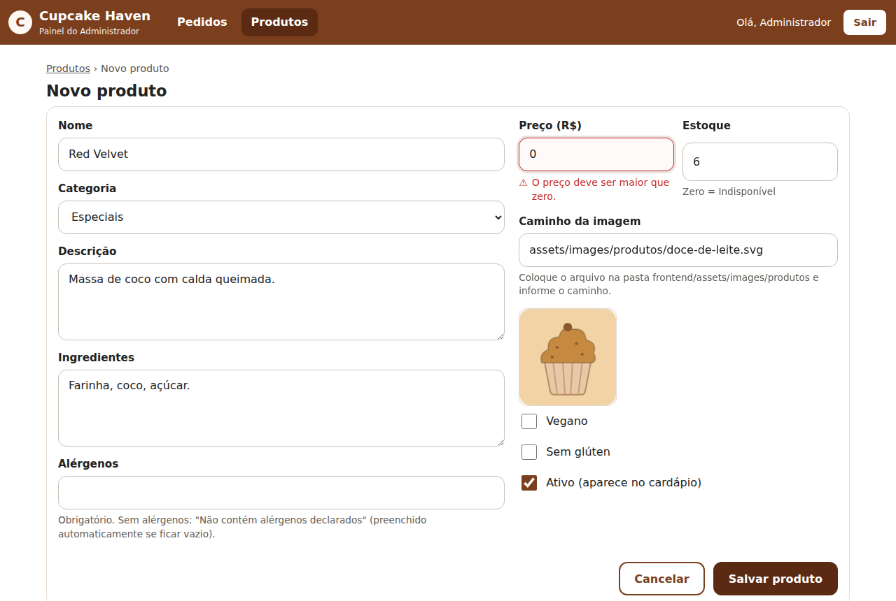

Cupons são cadastrados por script SQL (não há tela de cupons nesta versão).

## 19. Mensagens mais comuns

| Mensagem | O que fazer |
|----------|-------------|
| Faça login para continuar. | Entre na sua conta; depois você volta para a tela que pediu. |
| E-mail ou senha incorretos. | Confira os dados e tente de novo. |
| Este e-mail já está cadastrado. Tente fazer login. | Use a tela Entrar. |
| A senha deve ter pelo menos 8 caracteres, com letras e números. | Use uma senha mais forte. |
| Só temos N unidades deste cupcake no momento. | Diminua a quantidade. |
| Alguns itens do carrinho mudaram de preço ou ficaram indisponíveis... | Revise o carrinho antes de continuar. |
| Cupom inválido: ... | Verifique o código ou use outro cupom. |
| Pagamento recusado... | Tente de novo, troque a forma de pagamento ou cancele. |
| Você não tem permissão para acessar esta página. | A tela é de outro perfil ou o pedido é de outra pessoa. |
| Algo deu errado. Tente novamente em instantes. | Falha de comunicação; use "Tentar novamente". |
